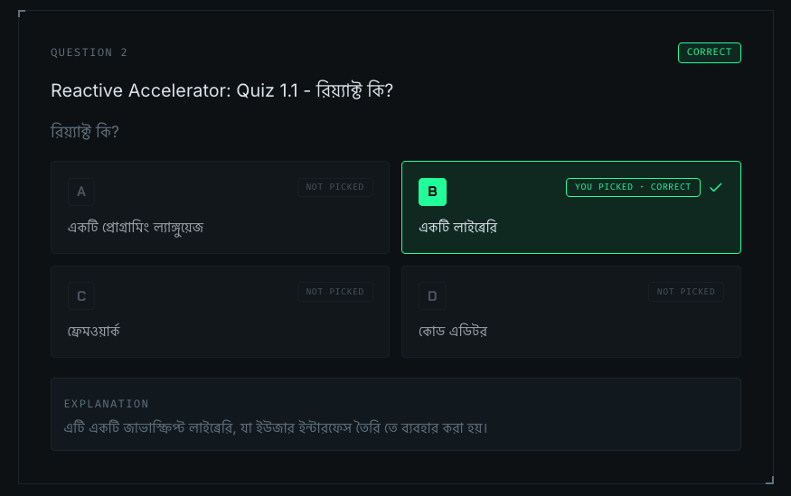

# 1.1 - Introduction to React: Why React? (Vanilla JS vs React.js)

> **এক লাইনে:** Vanilla JS-এ data বদলালে UI-ও হাতে করে বদলাতে হয়; React-এ শুধু **state** বদলালেই UI নিজে থেকে update হয়ে যায়।

**Key Questions:**

- React আসলে কোন সমস্যার সমাধান করে? (What problem does React actually solve?)
- React কি library না framework? (Is React a library or a framework?)
- JSX লিখলে browser সেটা বোঝে কীভাবে? (How does the browser understand JSX?)

---

## 📑 Table of Contents

- [Core Concepts](#core-concepts)
- [How the UI Works](#how-the-ui-works)
- [React & ReactDOM](#react--reactdom)
- [Babel — The Transpiler](#babel--the-transpiler)
- [JSX & Curly Braces](#jsx--curly-braces)
- [Code Walkthrough](#-code-walkthrough-এই-folder-এর-code)
- [Common Mistakes & Gotchas](#️-common-mistakes--gotchas)
- [Course Quiz](#-course-quiz)
- [Important Terms](#important-terms)
- [JavaScript Prerequisites](#-javascript-prerequisites)
- [Official Docs](#-official-docs)
- [Summary (Key Takeaways)](#summary-key-takeaways)
- [Interview Questions](#interview-questions)

---

## Core Concepts

### What is React?

> **Answer:** React is a JavaScript library focused on building user interfaces.

অর্থাৎ React-এর কাজ পুরো application চালানো নয় — এর একমাত্র চিন্তা হলো **user interface**। Data কোথা থেকে আসবে, routing কীভাবে হবে, server-এ কী হবে — এসব নিয়ে React মাথা ঘামায় না। সেজন্যই এটি library, framework নয়।

### What is a Library?

> **Answer:** Library হচ্ছে এমন কিছু code/tools, যা একটি নির্দিষ্ট কাজকে কেন্দ্র করে তৈরি।

Library-তে **তুমি** ঠিক করো কখন কোন function call করবে — control তোমার হাতে।

### What is a Framework?

> **Answer:** A framework is a complete toolset. একটা complete project করতে গেলে যা যা লাগে, তার অনেক কিছুই এর মধ্যে built-in থাকে। অর্থাৎ, এটি একটি **complete package**।

Framework-এ উল্টোটা হয় — **framework** ঠিক করে তোমার code কখন চলবে। একে বলা হয় **Inversion of Control**।

### Library vs Framework

> **Analogy:** Library হলো তোমার রান্নাঘরের **আলাদা আলাদা মশলা** — কোনটা কখন কতটুকু দেবে, সেটা তুমিই ঠিক করো। আর Framework হলো **রেডিমেড রান্নার রেসিপি বক্স** — বাক্সেই সব দেওয়া আছে, কিন্তু ধাপগুলো তাদের নিয়মেই মানতে হবে।

| | Library (React) | Framework (Next.js) |
| --- | --- | --- |
| Control কার হাতে | তোমার — তুমি React-কে call করো | Framework-এর — সে তোমার code call করে |
| Scope | একটি নির্দিষ্ট কাজ (UI rendering) | পুরো application (routing, data fetching, build) |
| নিয়মের কড়াকড়ি | কম, নিজের মতো structure সাজানো যায় | বেশি, নির্দিষ্ট convention মানতে হয় |

### কেন Vanilla JS ব্যবহার না করে React.js ব্যবহার করা হয়?

> **Answer:** Vanilla JS-এ data পরিবর্তন হলে আমাদের UI-ও **manually** update করতে হয়। কিন্তু React-এ শুধু data/state পরিবর্তন করলেই UI **automatically** update হয়।
>
> অর্থাৎ, **UI reacts according to the state**.

এই পার্থক্যটা এই folder-এর নিজের code-এই স্পষ্ট দেখা যায় — নিচের [Code Walkthrough](#-code-walkthrough-এই-folder-এর-code) দেখো।

### DOM Manipulation

DOM manipulation হলো JavaScript দিয়ে webpage-এর elements **create, update, delete, বা modify** করার process.

### What is State?

> **Answer:** যে data গুলো application-এ সময়ের সাথে change/update হয়, সেগুলোকে **state** বলা হয়।

`script.js`-এ `totalPrice` আর `reactScript.js`-এ `quantity` — দুটোই state। পার্থক্য হলো, React-এর state পরিবর্তন হলে React নিজে থেকেই আবার render করে।

---

## How the UI Works

### UI-এর মধ্যে কী কী কাজ হয়?

> **Answer:**
>
> 1. DOM তৈরি করা
> 2. User interaction listen করা এবং সে অনুযায়ী respond করা
> 3. Webpage-এ সবকিছু render করা

### Explanation

আমরা যখন কোনো HTML file browser-এ open করি, browser সেই HTML markup read করে তার **Document Object Model (DOM)** তৈরি করে। Browser যখন DOM তৈরি করে, তখনই আমরা webpage-এর elements দেখতে পাই। এরপর JavaScript এই DOM manipulate করে user action handle করে।

- ✅ HTML আমাদের **short-cut syntax** দেয় DOM তৈরি করার জন্য
- ⚠️ যদি আমরা manually pure DOM code লিখে সবকিছু তৈরি করতে চাই, তাহলে কাজটি অনেক **complex** এবং **time-consuming** হয়ে যায়

`reactScript.js`-এর প্রথম approach-টাই এর প্রমাণ — মাত্র একটা `div` আর একটা line text দেখাতে তিন লাইন code লেগেছে।

---

## React & ReactDOM

React library আসলে দুই ভাগে ভাগ করা, কারণ React শুধু browser-এর জন্য নয় — একই React code দিয়ে React Native-এ mobile app-ও বানানো যায়। তাই "UI কী হবে" আর "সেটা কোথায় আঁকা হবে" — এই দুই দায়িত্ব আলাদা package-এ রাখা হয়েছে।

### `react`

React user interface এবং user interaction তৈরি করতে সাহায্য করে।

### `react-dom`

React দিয়ে তৈরি করা UI-কে webpage-এ render করার কাজ ReactDOM করে। তবে এটি সরাসরি browser DOM-এ কাজ না করে আগে **Virtual DOM** ব্যবহার করে। সেখানে changes compare এবং prepare করার পর final update browser DOM-এ apply করা হয়।

```text
React (UI তৈরি)  →  Virtual DOM (compare + prepare)  →  Browser DOM (final update)
```

`react.html`-এ এই দুটো আলাদা `<script>` হিসেবেই load করা হয়েছে — `react.development.js` আর `react-dom.development.js`।

---

## Babel — The Transpiler

**প্রশ্ন ছিল:** transpiler/Babel সহজ ভাষায় কী? এটা React code-কে browser-এর বোধগম্য code-এ কীভাবে বদলায়, আর React শেখা ও লেখার সময় এটা কেন দরকার?

### সমস্যাটা কোথায়

Browser শুধু **plain JavaScript** বোঝে। কিন্তু আমরা React-এ লিখি JSX:

```jsx
const thirdApproach = (
  <div>
    <p>Hello</p>
  </div>
);
```

এই `<div>` তো JavaScript-এর syntax নয় — এটা দেখতে HTML-এর মতো। Browser-কে সরাসরি এটা দিলে সে **SyntaxError** দেবে, কারণ JavaScript-এ `<` মানে "less than"।

> **Analogy:** তুমি বাংলায় একটা দরখাস্ত লিখলে, কিন্তু যিনি পড়বেন তিনি শুধু English জানেন। মাঝখানে একজন **অনুবাদক** দরকার, যিনি তোমার বাংলা লেখাটা English-এ বদলে দেবেন। **Babel** হলো সেই অনুবাদক — তুমি JSX-এ লেখো, সে সেটা browser-এর ভাষায় (plain JavaScript) অনুবাদ করে দেয়।

### Babel আসলে কীসে রূপান্তর করে

এখানে একটা ভুল ধারণা পরিষ্কার করা দরকার: **Babel কিন্তু JSX-কে HTML-এ বদলায় না।** এটি JSX-কে বদলায় **JavaScript function call**-এ:

```jsx
// তুমি যা লেখো (JSX)
<div><p>Hello</p></div>

// Babel যা বানায় (plain JavaScript)
React.createElement("div", null, React.createElement("p", null, "Hello"));
```

লক্ষ্য করো — এটা হুবহু তোমার `reactScript.js`-এর **secondApproach**! অর্থাৎ JSX আসলে `React.createElement()` লেখার একটা সহজ short-cut, আর কিছু নয়। HTML তৈরি হয় সবার শেষে, browser-এ, ReactDOM-এর হাতে।

```text
JSX (তুমি যা লেখো)
   ↓  Babel — transpile (build time বা browser-এ)
React.createElement(...)  ← এখন এটা plain JavaScript
   ↓  React run করে
Virtual DOM (JS object)
   ↓  ReactDOM.createRoot().render()
Browser DOM  ← এখন screen-এ দেখা যায়
```

### Parser আর Transpiler-এর পার্থক্য

- **Parser:** code পড়ে তার গঠন বুঝে একটা tree (AST) বানায় — অর্থাৎ "তুমি কী লিখেছ" সেটা বোঝে।
- **Transpiler:** সেই tree ধরে code-টাকে **অন্য রূপে লিখে দেয়**, কিন্তু ভাষা একই থাকে (JS → JS)।

তাই Babel-কে **compiler** না বলে **transpiler** বলা হয় — compiler সাধারণত এক ভাষা থেকে অন্য ভাষায় নেয়, আর transpiler একই ভাষার এক রূপ থেকে আরেক রূপে নেয়।

### React শেখার সময় কেন দরকার

এই folder-এর `react.html`-এ Babel CDN থেকে load করা হয়েছে:

```html
<script src="https://unpkg.com/@babel/standalone/babel.min.js"></script>
<script defer type="text/babel" src="./reactScript.js"></script>
```

`type="text/babel"` লেখার কারণেই browser ওই file-টা নিজে চালানোর চেষ্টা করে না — Babel সেটা ধরে নেয়, transpile করে, তারপর চালায়।

- 🎓 **শেখার সময়:** কোনো `npm install`, bundler বা build step ছাড়াই শুধু একটা HTML file খুলে JSX লেখা শুরু করা যায়। মাঝখানের tooling-এর জটিলতা সরে যায়, মন পুরোটা React-এর concept-এ দেওয়া যায়।
- ⚠️ **কিন্তু production-এ নয়:** এখানে transpile হচ্ছে **browser-এ, প্রতিবার page load হওয়ার সময়** — তাই site ধীর হয়। আসল project-এ Vite বা Next.js আগেই (build time-এ) transpile করে রাখে, ফলে browser-কে শুধু তৈরি JavaScript পাঠানো হয়। পরের module `1.2`-তে Vite দিয়ে ঠিক এই কাজটাই করা হয়েছে।

---

## JSX & Curly Braces

**Markup-এর যেখানে dynamic value দিতে হবে, সেখানে curly braces `{}` ব্যবহার করতে হবে।**

JSX-এর ভেতরে যা লিখবে তা by default **text** হিসেবেই ধরা হয়। কোনো JavaScript value বসাতে চাইলে `{}` দিয়ে React-কে বলতে হয় — "এটা text নয়, এটা চালাও"।

```jsx
const productPrice = 500;

// ❌ text হিসেবে literally "productPrice" দেখাবে
<span>productPrice</span>

// ✅ 500 দেখাবে
<span>{productPrice}</span>

// ✅ ভেতরে যেকোনো JS expression চলে — তোমার নিজের code থেকে
<span>{productPrice * quantity}</span>

// ✅ attribute-এও একইভাবে
<a onClick={addToCart}>Add to cart</a>
```

`{}`-এর ভেতরে শুধু **expression** (যার একটা value আছে) বসে — `if` বা `for` এর মতো statement বসে না। শর্ত লাগলে ternary (`? :`) ব্যবহার করতে হয়।

---

## 🧪 Code Walkthrough (এই folder-এর code)

এই folder-এ একই product card চারবার তৈরি করা হয়েছে, প্রতিবার আগেরটার চেয়ে সহজ উপায়ে। এটাই এই module-এর মূল শিক্ষা।

| File | কী আছে |
| --- | --- |
| `template.html` | শুধু static markup, কোনো JS নেই — শুরুর বিন্দু |
| `index.html` + `script.js` | Vanilla JS version (manual DOM update) |
| `react.html` + `reactScript.js` | React version (চারটি approach পাশাপাশি) |

### Vanilla JS — `script.js`

```js
let totalPrice = 0;

addToCartButtonElement.addEventListener('click', () => {
    totalPrice += productPrice;   // ১. data বদলালাম

    // update UI
    totalPriceElement.innerText = `Total: ৳ ${totalPrice}`;  // ২. UI হাতে বদলালাম
});
```

এখানেই আসল সমস্যাটা দেখা যায় — data বদলানোর পর UI বদলানোর কাজটা **আলাদাভাবে নিজে** করতে হচ্ছে। একই `innerText` line file-এ দুবার লিখতে হয়েছে (একবার শুরুতে, একবার click-এ)। আর `getElementById` দিয়ে তিনটা element ধরে রাখতে হয়েছে। Page-এ ১০টা জায়গায় `totalPrice` দেখালে ১০ জায়গায় update করতে হতো — একটা ভুলে গেলেই UI আর data আলাদা হয়ে যেত।

### React — `reactScript.js`-এর চারটি approach

**১. Pure DOM (`root-1`)** — JavaScript দিয়ে হাতে element বানানো:

```js
const firstApproach = document.createElement("div");
firstApproach.innerText = "Hello World from DOM!";
document.getElementById("root-1").appendChild(firstApproach);
```

**২. `React.createElement` (`root-2`)** — React-এর নিজস্ব উপায়, কিন্তু JSX ছাড়া। nested element লিখতে গিয়ে কেমন কঠিন হয়ে যাচ্ছে খেয়াল করো:

```js
const secondApproach = React.createElement(
  "div", null,
  React.createElement("p", null, "Hello World from React"),
);
ReactDOM.createRoot(document.getElementById("root-2")).render(secondApproach);
```

**৩. JSX (`root-3`)** — উপরের ঠিক একই জিনিস, কিন্তু পড়তে সহজ। Babel এটাকে approach ২-এ বদলে দেয়:

```jsx
const thirdApproach = (
  <div>
    <p>Hello</p>
  </div>
);
```

**৪. Component + state (`root-4`)** — পুরো product card, যা `script.js`-এর কাজটাই করে:

```jsx
function Product() {
  const [quantity, setQuantity] = React.useState(0);

  function addToCart() {
    setQuantity(quantity + 1);   // শুধু state বদলালাম — UI নিজে update হবে
  }

  return (
    /* ... markup ... */
    <span>{productPrice * quantity}</span>
  );
}
```

এখানে `innerText`, `getElementById`, কোনো manual UI update নেই। শুধু `setQuantity()` — বাকিটা React করে। **এটাই "UI reacts according to the state"।**

### একটা গুরুত্বপূর্ণ observation

```jsx
ReactDOM.createRoot(document.getElementById("root-4")).render(
  <>
    <Product />
    <Product />
  </>,
);
```

দুটো `<Product />` render করা হয়েছে একটা **Fragment** (`<>...</>`)-এর ভেতরে। ব্রাউজারে চালিয়ে দেখো — **একটা card-এ "Add to cart" চাপলে অন্যটার total বাড়ে না।** কারণ প্রতিটা component instance তার **নিজের আলাদা state** রাখে। একই `Product` function, কিন্তু দুটো স্বাধীন `quantity`। Component-কে reusable বলার আসল কারণ এটাই।

> 💡 `script.js`-এ price 5000, আর `reactScript.js`-এ 500 — দুই file-এ দুই মান। code-এর ভুল নয়, তবে পাশাপাশি চালালে সংখ্যা মিলবে না, তাই জেনে রাখা ভালো।

---

## ⚠️ Common Mistakes & Gotchas

- **`class` নয়, `className`:** JSX আসলে JavaScript, আর `class` হলো JavaScript-এর **reserved keyword**। তাই তোমার `reactScript.js`-এ সব জায়গায় `className` ব্যবহার করা হয়েছে। একইভাবে `for` হয়ে যায় `htmlFor`।
- **`onClick={addToCart}` বনাম `onClick={addToCart()}`:** প্রথমটা function-এর **reference** দেয় — click হলে React চালাবে। দ্বিতীয়টা render-এর সময়ই function **চালিয়ে** ফেলে, তারপর তার return value (`undefined`) handler হিসেবে বসায়। এটা নতুনদের সবচেয়ে common bug।
- **`<a href="#" onClick={...}>` — সতর্কতা:** তোমার code-এ button-এর জায়গায় `<a>` tag ব্যবহার করা হয়েছে। click করলে state ঠিকই বাড়বে, কিন্তু browser URL-এ `#` যোগ করে ফেলবে, কারণ link-এর default behaviour আটকানো হয়নি। সমাধান দুটো — `<button>` ব্যবহার করা (accessibility-র জন্যও ভালো), অথবা `addToCart(e)`-এর ভেতরে `e.preventDefault()` লেখা।
- **"JSX দ্রুত বলে HTML বাদ দিই" — এটা ভুল ধারণা:** (quiz 1-এর option D ঠিক এই ফাঁদটাই পাতে) JSX গতির জন্য নয়, **পড়তে ও লিখতে সহজ** করার জন্য। Babel তো শেষে সেটাকে `React.createElement`-এই বদলে দেয়।
- **Babel CDN শুধু শেখার জন্য:** production-এ browser-এ transpile করলে প্রতিবার page load ধীর হয়। আসল project-এ Vite/Next.js আগেই transpile করে রাখে।
- **`{}` মানে JavaScript expression:** `{}`-এর ভেতরে `if`/`for` লেখা যায় না, কারণ ওগুলো statement — value return করে না।

---

## 📝 Course Quiz

কোর্সের Quiz 1.1-এর প্রশ্ন দুটি (দুটোই সঠিক হয়েছে):

| প্রশ্ন | উত্তর |
| --- | --- |
| রিয়্যাক্ট মূলত কোন সমস্যার সমাধান করে? | ✅ ইউজার ইন্টারফেস তৈরি এবং ম্যানেজমেন্ট অনেক সহজ করে দিচ্ছে |
| রিয়্যাক্ট কি? | ✅ একটি লাইব্রেরি |




**মনে রাখার মতো:** React বড় project-কে ছোট ছোট **component**-এ ভেঙে নিতে দেয়, তাই UI তৈরি করাও সহজ, আবার **manage** করাও সহজ। এই "manage করা সহজ" অংশটাই বেশিরভাগ সময় বাদ পড়ে যায়।

---

## Important Terms

| Term | অর্থ |
| --- | --- |
| **JSX** (JavaScript XML) | JavaScript file-এর ভেতরেই HTML-এর মতো markup লেখার syntax extension। |
| **Parser & Transpiler** (e.g., Babel) | যে tool আধুনিক JS ও JSX-কে পুরোনো browser-ও বোঝে এমন সাধারণ JavaScript-এ বদলে দেয়। |
| **React Component** | UI-এর একটি স্বাধীন, reusable অংশ — ঠিক যেন একটা Lego block। |
| **Functional Component** | সাধারণ একটি JavaScript function, যা React element (JSX) return করে। React লেখার আধুনিক standard এটাই। |
| **Dumb Component** | HTML-এর মতো presentational component, যার নিজস্ব logic নেই। |
| **Fragment** (`<></>`) | React-এর built-in component, যা একাধিক element-কে একসাথে group করে — কিন্তু আসল DOM-এ বাড়তি কোনো node যোগ করে না। |
| **Tuple** | নির্দিষ্ট সংখ্যক ও নির্দিষ্ট type-এর element থাকা array। React Hooks-এ খুব দেখা যায়, যেমন `useState`-এর `[state, setState]`। |

---

## 🔗 JavaScript Prerequisites

- **Array destructuring:** `const [quantity, setQuantity] = React.useState(0)` — এই `[a, b]` লেখাটা React-এর নিজস্ব কিছু নয়, এটা array থেকে মান বের করে আনার **JavaScript syntax**। `useState` আসলে দুই element-এর একটা array return করে। ⚠️ এটি এখনো js-refresher-এ লেখা হয়নি।
- **Callback function & function reference:** `addEventListener('click', () => {...})` এবং `onClick={addToCart}` — দুটোই function-কে **value হিসেবে** পাঠানোর উদাহরণ। → [js-refresher](../../../module-0/js-refresher/README.md)
- **`let` vs `const`:** `script.js`-এ `let totalPrice` (বদলায়) আর `const productPrice` (বদলায় না) — কেন এই পার্থক্য, তা এখানে দেখা যায়। → [js-refresher](../../../module-0/js-refresher/README.md)
- **Template literals:** `` `Total: ৳ ${totalPrice}` `` — backtick দিয়ে string-এর ভেতরে value বসানো।

---

## 📚 Official Docs

- [Quick Start — react.dev](https://react.dev/learn)
- [Writing Markup with JSX — react.dev](https://react.dev/learn/writing-markup-with-jsx)
- [JavaScript in JSX with Curly Braces — react.dev](https://react.dev/learn/javascript-in-jsx-with-curly-braces)
- [Render and Commit — react.dev](https://react.dev/learn/render-and-commit)
- [What is Babel? — babeljs.io](https://babeljs.io/docs/)

---

## Summary (Key Takeaways)

- 🔄 **UI is a Function of State** — React-এ তুমি শুধু state বদলাও, UI নিজে থেকেই সেই state অনুযায়ী update হয়ে যায়।
- 🧭 **Declarative Approach** — Vanilla JS-এ যে manual DOM manipulation করতে হতো, React সেটা আড়ালে নিয়ে যায়।
- 🧩 **Separation of Concerns** — `react` ঠিক করে UI কী হবে, আর `react-dom` সেটাকে browser-এ render করে।
- 🧱 **Component-Driven** — ছোট ছোট reusable functional component জোড়া দিয়েই React application তৈরি হয়, আর প্রতিটি instance-এর state আলাদা।
- 🔤 **JSX হলো short-cut** — Babel এটাকে `React.createElement()` call-এ বদলে দেয়, HTML-এ নয়।
- 🎯 **React library, framework নয়** — এর একমাত্র কাজ UI; control তোমার হাতেই থাকে।

---

## Interview Questions

<details>
<summary><b>Q1: What is the main difference between a Library and a Framework, and where does React fit?</b></summary>

> **Answer:** A library is a collection of specific functions that you call to perform tasks, meaning you control the flow of the application. A framework dictates the architecture and calls your code (Inversion of Control). React is technically a library because it only concerns itself with rendering the UI. However, it is often used within frameworks like Next.js to provide a complete application architecture.

</details>

<details>
<summary><b>Q2: Explain the concept of "State" in React.</b></summary>

> **Answer:** State is an application's internal memory. It is a JavaScript object or primitive value that holds data that might change over the lifetime of a component. When a component's state changes, React automatically re-renders that component to ensure the UI stays synchronized with the latest data.

</details>

<details>
<summary><b>Q3: Why is direct DOM manipulation considered a bad practice in React?</b></summary>

> **Answer:** React relies on its own internal representation of the UI (the Virtual DOM) to optimize updates and ensure consistency. If you bypass React and manipulate the DOM directly (e.g., using `document.getElementById`), you break synchronization between React's state and the actual UI, which can lead to unpredictable bugs and performance issues.

</details>

<details>
<summary><b>Q4: What is JSX and why do we use it?</b></summary>

> **Answer:** JSX (JavaScript XML) is a syntax extension for JavaScript that allows developers to write HTML-like markup inside JS files. It is not strictly required, but it makes writing React components much more intuitive and readable by visually resembling the UI it produces. Under the hood, JSX is compiled by tools like Babel into standard `React.createElement()` calls.

</details>

<details>
<summary><b>Q5: What are React Fragments and what problem do they solve?</b></summary>

> **Answer:** A React Fragment (often written as `<></>`) allows developers to group multiple sibling child components together without adding an unnecessary wrapper element (like a `<div>`) to the final DOM. This is important because React components can only return a single parent element, and wrapping everything in `div`s can break CSS layouts (like flexbox or grid) or create bloated HTML structures.

</details>

<details>
<summary><b>Q6: What does Babel actually transpile JSX into, and why can't the browser run JSX directly?</b></summary>

> **Answer:** Browsers only understand plain JavaScript, and JSX is not valid JavaScript — a browser parsing `<div>` inside a `.js` file would throw a SyntaxError, since `<` is the less-than operator. Babel transpiles JSX into nested `React.createElement(type, props, ...children)` calls, which *are* plain JavaScript. A common misconception is that Babel converts JSX into HTML; it does not. React calls those functions to build a Virtual DOM tree, and only then does ReactDOM create the real DOM nodes at runtime.

</details>

---

## 🚀 Overall Enhancement Suggestion

এই topic-টা পুরোপুরি বুঝতে পরের ধাপগুলো:

- **`useState` গভীরভাবে** — `setQuantity(quantity + 1)` বনাম `setQuantity(prev => prev + 1)`-এর পার্থক্য কী, আর কখন কোনটা লাগে।
- **State কেন immutable ভাবে বদলাতে হয়** — সরাসরি `quantity++` লিখলে React কেন re-render করে না।
- **Virtual DOM ও reconciliation** — React ঠিক কীভাবে বুঝে কোন অংশটুকু বদলাতে হবে (এটাই পরের topic `1.3`)।
- **Props** — এখন দুটো `<Product />`-ই একরকম; আলাদা নাম/দাম দিতে হলে props লাগবে (`1.5`-এর পরে)।
- **Build tool দিয়ে React** — CDN + Babel বাদ দিয়ে Vite দিয়ে project setup (`1.2`)।
- **JS foundation:** array destructuring আর template literals — js-refresher-এ যোগ করে নিলে ভালো হয়।
